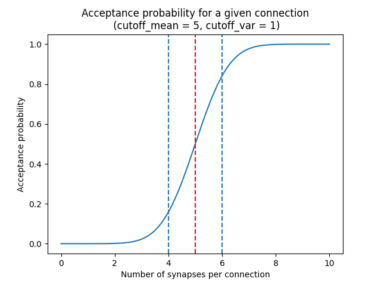

# Projectionizer
The projectionizer aims at sampling synapses with pre-synaptic axons (refered in the code as virtual fibers) coming from outer regions.
It produces 3 files (nrn.h5, nrn_efferent.h5, nrn_summary.h5) which are 3 different views from the same data: a list of connection between a virtual fiber and a segment belonging to the circuit.

# Morphological constraints
The sampling must be done with respect to the following constraints:
- the synaptical density along the column
- the number of synapse per connection (neuron/virtual fiber) density distribution
- the efferent neuron count distribution (number of neurons a virtual fiber is connected to)

# Usage

## Starting a new job
`./apps/projectionizer start -o output_folder -c config_file.yaml` will generate projections using the passed config file.

Note: the job won't start if a `config.yaml` file is already present in the output directory. This is to prevent overriding jobs by mistake.

## Resuming a job
Calling `./apps/projectionizer resume -o output_folder` will resume the job using parameters in the `config.yaml` present in the folder.

## Dichotomy pipeline
The projection validity is constrained by comparing the L4PC connectivity (mean value of the number of synapses per connection in Layer 4 Pyramidal Cells (L4PC)) with the experitmental data of `~7.0`. This value is directly influenced by the oversampling value: a lower oversampling will lead to a lower connectivity and vice-versa.

The `dichotomy` sub command automates the trial-and-error process of finding the correct oversampling value. It will generate projections with different oversampling values until the experimental L4PC connectivity value is matched.
`./apps/projectionizer dichotomy -o . -c config_file.yaml --connectivity-target 7.0 --min-param 2.1 --max-param 15.0 --target-margin 0.2` can be used to launch the dichotomy.
- connectivity-target is the L4PC connectivity to reach
- target-margin is the accepted tolerance for the L4PC connectivity
- min-param is the minimum oversampling values
- max-param is the maximum oversampling values

# Configuration file
CommonParams lists params than are common to all tasks.
- circuit_config: the CircuitConfig absolute path.
- geometry: the region geometry. Currently supports ('hex' (for hexagonal) and 's1hl' for S1 Hindlimb region, 's1' for current s1 defined in NSETM-94).
- n_total_chunks: in order to prevent RAM from exploding, the computation is splitted into chunks. This is the number of chunks.

# Algorithm
## General picture
Creation of the projection is a 3 step process.
1. (Post-synaptic dendritic) segments from the circuit are randomly picked, they will be locations of the future synapses. The probability of picking a segment is proportional to its length (and segments can be picked multiple times)
2. Each picked segment is assigned to a (pre-synaptic) virtual fiber. The assignment is based on the distance segment/fiber.
3. To match the synapses count per connection (ie. the number of synapses belonging to a given neuron and connected to a given fiber) profile, some connections (segments from the same neuron, connected to the same fiber) are removed. The connection acceptance probability follows a normal cumuative distribution function of the number of synapses.

The mean of the normal law is computed per mtype in order to match a given rejection fraction (that can be changed in the config file). The variance is the same for all mtypes and can be changed in the config file.

## Implementation
This program is based on the task manager Luigi. Every step of the computation (called a task) is saved on disk. Already processed tasks will be loaded from disk instead of being recomputed.

Here is the description of the tasks (by order in which they appear):
- step_0_sample.py (synapse sampling)
  - Height: Voxelization of the region space and association for each voxel to a columnar height (with respect to the bottom of layer 6, which is height=0)
  - VoxelSynapseCount: Association of each voxel to a number of segment to be picked. This is given by synaptic density at the height at which the voxel is and by the oversampling factor.
  - FullSample: picking segments until matching the voxel counts computed in the previous step
  - SampleChunk: splitting the dataframe into chunks
Fun fact: the entire synapse sampling process does not involve any fibers.

- step_1_assign.py (fiber-synapse matching):
  - VirtualFibersNoOffset: Virtual fiber generation. For the time being fibers are considered as straight so they are represented by a starting point and a direction.
  - ClosestFibersPerVoxel: for each voxel, search of the closest fibers
  - SynapseIndices: creation of an intermediate mapping synapse -> voxel
  - CandidateFibersPerSynapse: each synapse its matched with its closest fibers
  - FiberAssignment: for each synapse, selection of a fiber among the candidate fibers. The probability follows a normal law of the distance between the synapse and the fiber. The sigma of the gaussian can be changed in the configuration file.
- step_2_prune.py (selecting neuron-fibers pairs to keep):
  - GroupByConnection: for each chunk, compute how many synapses connect a neuron with a fiber.
  - ReduceGroupByConnection: reduction of the previous step
  - CutoffMeans: for each mtype, computation of the cutoff value matching the required synaptical fraction to be kept.
  - ChooseConnectionsToKeep: choose connections to keep. The probability to be kept follows a cumulative normal distribution, where mean values come from the previous step and the sigma is a parameter from the configuration file.
  - PruneChunk: for each chunk, remove synapses not belonging to a kept connection.
  - ReducePrune: reduction of the previous step

- step_3_write.py (writing nrn.h5, nrn_efferent.h5, nrn_summary.h5)
Writing of the result using different views:
  - WriteSummary: summary
  - WriteNrnH5: results are grouped by tgid (neuron ID)
  - WriteNrnEfferentH5: results are grouped by sgid (virtual fiber ID)
