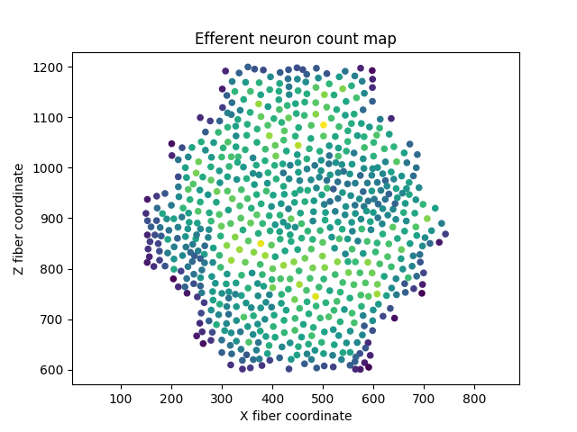
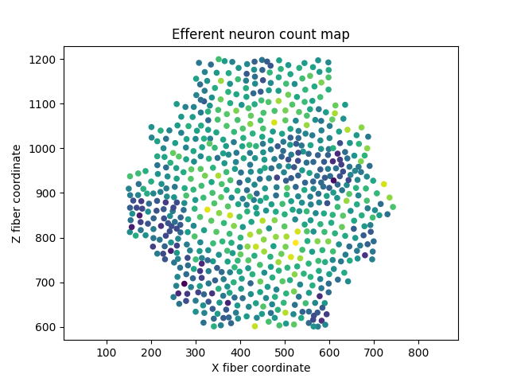

Frequently Asked Questions
==========================

 .. _FAQ_Apron:

Apron
-----

**Well, what about apron? What is this apron you speak of and what is the magic therein?**

In case of hex columns, there are so-called edge effects measurable in terms of neuron count per fiber as can clearly be seen in the image below. This effect happens due to there not being synapses for the fibers to connect to on the other side of the edge of the region.

This is where the apron comes in. Apron is a rectangular box limited by XZ coordinates (Y-axis-wise it extends from -infinity to infinity) that surrounds the column.
When apron is used, Projectionizer will add synapses inside the bounding box (i.e., also outside the region) and thus mitigating the edge effect as can be seen in the image below.

Configuration File
------------------

**I am used to running projectionizer with the old config.
I really do not want to read the whole** :ref:`configuration` **section again.
How do I get my projections?**

Fortunately, there is an :ref:`example<Config_ExampleFile>` one can check and compare the old configuration to it.
It is *mostly* the same as the old one: some parameters might have changed place or name and some are added or removed.
These changes should also be reflected in the :ref:`changelog`.
