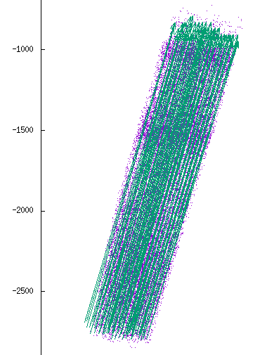
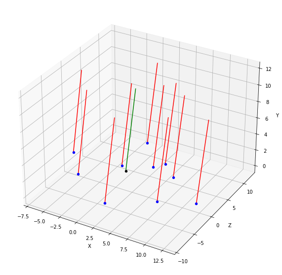

Workflow in a nutshell
======================

Projectionizer workflow boils down to five main steps: Generating fibers, sampling synapses, assigning fibers to synapses, pruning the connections and finally writing the projections to a file.

Fiber Generation
----------------
Fiber locations can be generated using two different methods: K-means clustering and ray casting.

**K-means clustering** is targeted for hexagonal columns. It finds all the cell XZ-wise positions for given regions or a bounding rectangle (i.e., "apron") and partitions the data to K clusters. It then maps all the cluster centroids to a y-plane, assumes these XYZ-positions as fiber starting positions and sets the fibers' direction to be either positive or negative Y-direction.

**Ray casting** is targeted for more complex circuits. In essence, its workflow looks like this:
 #. For given regions, select voxels between 2nd and 3rd layer from the bottom (e.g., L5 and L4 in SSCX, respectively).
 #. Take the directions of the normal vectors at these positions.
 #. For each of these so-called boundary voxels, start tracing its normal (a.k.a., direction) vector backwards:
     * If the ray trace hits a voxel in the bottom of a bottom layer (e.g., L6 in SSCX), take its position as that of the fiber and the normal direction as that of the fiber.
     * Otherwise, continue to the next boundary voxel.
 #. If fiber count is less than desired, generate extra fibers

The trace back from upper layers is done to ensure that the column and fiber directions are a better match.

The fiber count is increased by replacing each of the fibers with a suitable ratio of new fibers parallel to the original. The fibers are all on the same plane orthogonal to the fibers. In the image below the green line represents the original fiber and the red lines represent the new fibers that will replace the original.

.. |Config| replace:: :doc:`config`

Sampling
--------
Post-synaptic dendritic segments within the defined regions are picked randomly. They will be the locations of the future synapses. The number of sampled synapses at this point is affected by the density profile and oversampling factor defined in the |Config|.

Tasks related to sampling (in order of appearence in `step_0_sampling.py`):
 * **VoxelSynapseCount** generates a VoxelData instance containing the number of synapses to be sampled per voxel
 * **Height** generates a VoxelData instance containing the relative height of each voxel inside the regions defined in the |Config|. Voxels outside the regions are NaNs.
    * the format of the relative height is given as L.P in which L is the Layer (0 is the bottom layer) and P is the relative height in that layers
       * e.g., 2.45 means at the height of 45% of the 3rd layer from the bottom
 * **SampleChunk** splits the full sample into smaller chunks
 * **FullSample** picks samples from the segments until each voxel has the desired number of synapses
 * **SynapseDensity** parses the synapse density profile in the |Config| to a dictionary

Assigment
---------
Each of the picked synapses are assigned to a (pre-synaptic) fiber. The assignment is probabilistic and is based on the distance between the segment and fiber. The probability follows a normal law of the distance between the synapse and the fiber. The sigma of the gaussian can be changed in the |Config|.

Tasks related to assignment (in order of appearence in `step_1_assign.py`):
 * **VirtualFibersNoOffset** creates a CSV file of the straight fibers without adding the offset defined in the |Config| to the sgid
 * **ClosestFibersPerVoxel** selects the defined number (closest_count in the |Config|) of closest fibers for each voxel
 * **SynapseIndices** maps synapse positions to voxel indices
 * **CandidateFibersPerSynapse** combines synapses with their candidate fibers
 * **FiberAssignment** assigns each synapse with a fiber.

Pruning
-------
To match the synapses count per connection (ie. the number of synapses belonging to a given neuron and connected to a given fiber) profile, some connections (segments from the same neuron, connected to the same fiber) are removed. The connection acceptance probability follows a normal cumuative distribution function of the number of synapses.

Tasks related to pruning (in order of appearence in `step_2_prune.py`):
 .. _GroupByConnection:

 * **GroupByConnection** computes how many synapses connect a neuron to a fiber for each chunk
 * **ReduceGroupByConnection** concatenates the chunks computed in :ref:`GroupByConnection <GroupByConnection>`
 * **CutoffMeans** computes the cut off value for each mtype to leave a desired fraction of the synapses (if oversampling was used)

 .. _ChooseConnectionsToKeep:

 * **ChooseConnectionsToKeep** probabilistically chooses the connections to keep

 .. _PruneChunk:

 * **PruneChunk** removes the synapses that are not in the connections chosen in :ref:`ChooseConnectionsToKeep <ChooseConnectionsToKeep>`
 * **ReducePrune** concates the chunks that were pruned in :ref:`PruneChunk<PruneChunk>`

Write
-----
Projectionizer writes edges and nodes in SONATA format. For now, it also outputs the user.target file until node set files are fully supported.
 * **projections-nodes.h5**: projection node file in a SONATA format
 * **projections-edges.h5**: projection edge file in a SONATA format
 * **user.target**: target file containing the fiber IDs (sgid)

Volume Transmission
-------------------
Volume transmission workflow is run on top of the regular projections workflow to simulate the effects of acetylcholine release into the extrasynaptic space.

The main phases of the workflow are:

#. Spherical **sampling** of the affected synapses

   #. For each source (input) synapse, find all the segments within given radius of the synapse
   #. Within each found segment, randomly pick a target synapse position (still staying within the radius)
   #. For each target synapse, compute the distance from the source (input) synapse

#. **Parameterization** of all the sampled synapses

   * The afferent cell ids (`sgid`) are those of the input synapses
   * The efferent cell ids (`tgid`) are those of the sampled synapses

#. **Scaling** the conductance of the volume transmission projections according to the distance

   #. Map the distances between sgid and tgid (within `[0, radius]`) linearly to given interval (e.g., `[1.0, 0.1]`)
   #. Use the mapped scaling factors as conductance (i.e., `conductance = scaling_factor`)
